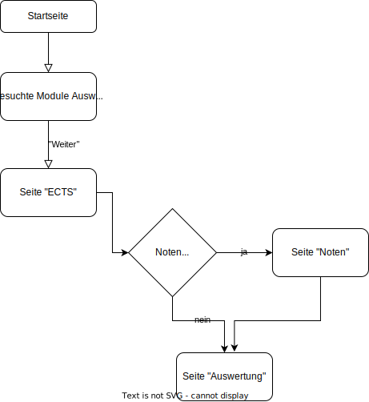

# Problembeschreibung 
Mit dieser Seite soll für spezifisch für DBM-Student*innen eine Lösung geboten werden, um einen Überblick über den Fortschritt und die Leistung im Studium zu bekommen.
Da das Studium durch Wahlpflichtmodule zu einem grossen Teil selbst gestaltet werden kann, geht die Übersicht über die erreichten ECTS Punkte schnell verloren. Dieses Tool soll helfen, der studierenden Personen aufzuzeigen, wie viele Module in welchen Bereich noch zu absolvieren sind.
Ausserden soll ein Notenrechner integriert werden, welcher den aktuellen Notenschnitt ausrechnen kann.

# Funktionalitäten
## Funktionalität 1: ECTS-Rechner
Anhand der ausgewählten Module soll ausgerechnet werden

# Ablauf

# Betrieb

# Probleme

# Benutzung / Walkthrough

