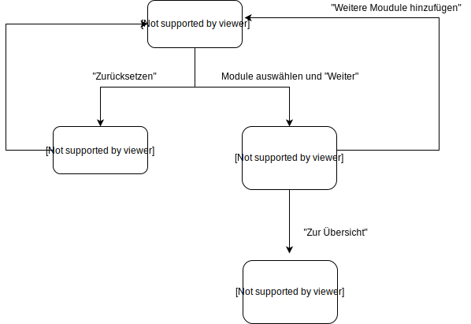

# ECTS-Rechner

## Inhalt README
1. [Problembeschreibung](#problembeschreibung--ausgangslage)
2. [Funktionalität](#funktionalität-ects-rechner)
3. [Ablauf](#ablauf-des-programms)
4. [Workflow](#workflow)
5. [Mögliche Erweiterungen](#mögliche-zuknftige-erweiterungen-des-programms)

## Problembeschreibung / Ausgangslage 
Mit dieser Seite soll für spezifisch für DBM-Student*innen eine Lösung geboten werden, um einen Überblick über den Fortschritt und die Leistung im Studium zu bekommen.
Da das Studium durch Wahlpflichtmodule zu einem grossen Teil selbst gestaltet werden kann, geht die Übersicht über die erreichten ECTS Punkte schnell verloren. 
Dieses Tool soll helfen, der studierenden Personen aufzuzeigen, wie viele Module in welchen Bereich noch zu absolvieren sind.

**Relevante Informationen für den ECTS-Rechner:** 
* Pflichtmodule: Müssen während dem Studium absolviert werden. 
* Wahlpflichtmodule: Können von den Studierenden selber ausgewählt werden. 
* Modulgruppen der Wahlpflichtmodule: "User Experience", "Information Technology", "Digital Innovation" und "Sozial- und Methodenkompetenz"

**Folgende Anzahl ECTS Punkte benötigt man:** 
* Insgesamt: 180 ECTS 
* Minimum pro Modulgruppe: Mind. 8 ECTS für die Modulgruppen "User Experience", "Information Technology" und "Digital Innovation" und mind. 4 ECTS in "Sozial- und Methodenkompetenz"
* Major: Für einen Major benötigt man mind. 20 ECTS in den Modulgruppen "User Experience", "Information Technology" und "Digital Innovation". In "Sozial- und Methodenkompetenz" kann man keinen Major machen.

## Funktionalität: ECTS-Rechner  
Anhand der ausgewählten Module soll ausgerechnet werden, wie viel ECTS man im Studium gemacht (insgesamt und pro Modulgruppe).
Dafür werden als Basis Daten aus zwei json Files benötigt:  
***module.json:*** 
In module.json wird für jedes Modul ein Dictionary mit folgenden Werten erstellt: Modul (str), ECTS (int), Modulgruppe (str), Absolviert (bool) .
  
***ects.json:*** Hier werden die ECTS-Werte (int) hinterlegt für das Ausrechnen des Fortschritts.

  Die Module werden dann auf der Startseite in einer Liste mit Checkboxen angezeigt.
Wird ein Modul ausgewähl werden dadurch im json die Daten angepasst und die Rechnungen vorgenommen.
Die ausgerechneten Werte werden danach auf den Seiten "ECTS" und "Auswertung" angezeigt. 
Zudem können die Daten zurückgesetzt werden und bereits ausgewählte Module werden angezeigt.
Dadurch ist die Übersicht auch bei mehrmaliger Verwendung des Tools gewährleistet.

*Wie der Code genau funktioniert und welche Funktionen verwendet wurden ist in der main.py und den html Files als Kommentar zu lesen*

## Ablauf des Programms

## Workflow
### 1. Dateneingabe: Auswahl der besuchten Module
Auf der Startseite des Programms die besuchten Module auswählen.  
Danach auf "Weiter" klicken.  
Oder Alternativ mit dem Button "Zurücksetzen" alle Daten auf den Ausgangswert setzen. 

### 2. Datenverarbeitung: Speichern der ausgewählten Module in json
(Die Datenverarbeitung erfolgt ohne Handlung des Users.)  
**Wenn man bei der Startseite auf "Weiter" geklickt hat:** 
Für jedes ausgewählte Modul wird im json der boolean Wert "Absolviert" von false auf true gesetzt.
Da für jedes Modul auch ein ECTS Wert als int hinterlegt wurde, können dadurch die Berechnungen der ECTS-Werte durchgeführt werden.
  **Wenn man bei der Startseite auf "Zurücksetzen" geklickt hat:** 
Beim zurücksetzen werden alle Werte auf den Ausgangswert zurückgesetzt. 
Das bedeutet das alle Module auf nicht Absolviert ("Absolviert": False) gesetz werden und die ECTS auf die jeweiligen Startwerte.
  
*Wie die Datenverarbeitung funktioniert wird im Punkt "Funktionalitäten" noch genauer erklärt.*

### 3. Datenausgabe: Berechneter Studiumsfortschritt
Auf der Seite "ECTS" sieht man den berechneten Fortschritt des Studiums. Insgesamt und pro Modulgruppe.
Zusätzlich wird noch ein individueller Text angezeigt, je nachdem wie weit man ist.
Bei den Modulgruppen wird zudem angezeigt, wie viel ECTS man minimum benötigt oder für den Major.
 Auf dieser Seite kann man dann entweder weiter zur Auswertungs-Seite oder man kann mit dem Button "Weitere Module hinzufügen" zurück auf die Startseite.
Zurück auf der Startseite sind dann die bereits gewählten Module unter der Auswahl aufgelistet.

### 4. Datenausgabe 2: Plotly Diagramm
Auf der Seite "Auswertung" werden die Fortschritte in den Modulgruppen 
"User Experience", "Information Technology", "Digital Innovation" visuell dargestellt.
Zudem erkennt man, wie viel man für das Minimum und für den Major noch erledigen muss.

## Mögliche zukünftige Erweiterungen des Programms
Um das Tool noch nützlicher zu machen könnte man es beispielsweise folgendermassen erweitern:
* Möglichkeit, Module nach Modulgruppe zu Filtern
* Vorschläge zu Modulen, welche man aufgrunde der vorhandenen ECTS noch benötigt
* Einzelne Module austragen können (Nicht alles zurücksetzen)
* Module als Favorit markieren (z.B. für zukünftige Semester)
* Neue/Spezielle Module manuell eintragen können
* Visuelle Ausarbeitung: Beispielsweise werden erledigte Module Grün angezeigt
* Seite "Module" mit zusätzlichen Informationen zu Modulen und Inhalten
* Notenrechner

